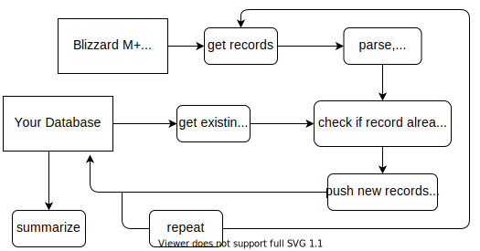

# Metawatch 

Backend code for collection and storage of Blizzard's Mythic+ leaderboard data.


[](https://raw.githubusercontent.com/ily123/metawatch-dash/master/LICENSE)
[](https://github.com/psf/black)

## Overview 



The pipeline is as follows:
1. Query Blizzard's API for current week's M+ leaderbord
2. Parse leaderboard data, assign unique ids to all records
    * Principally, the data is parsed into two tables (where each row is a 'record'):
        * ```run``` - each row corresponds to a M+ run with all of its metadata (level, instance, time, etc)
        * ```roster``` - player chracter data (name, spec, realm, etc), linked to the run table via ```run_id```
        * each ```run``` record normally corresponds to 5 ```roster``` records (there are 5 player characters per run)
3. Retrieve ids of M+ records already in our database (for the current week)
4. Find records that are new
5. Push new records into the database
6. Summarize data in the DB and send it to the front-end ($$LINK$$)

## Repo struct

```
    ├── data/                      # saves SQLite summary here, empty
    ├── notebooks/                 # research & test nbs; for posterity, PATHs broken
    ├── sql_scripts/               # SQL scripts to create empty DB tables
    ├── blizzard_api.py            # module with fetch/parse logic
    ├── blizzard_credentials.py    # authorization module
    ├── mplusdb.py                 # database connector
    ├── README.md                  
    ├── requirements.txt           
    ├── summarize.py               # script to create / update / export summary data in the DB
    ├── tasks.py                   # high-level methods that compose the pipeline
    └── utils.py                   # utility methods
```

## Prerequisite: MySQL server
The code sits on top of a MySQL RDBMS. The version I am using is:

```
Ver 8.0.21 for Linux on x86_64 (MySQL Community Server - GPL)
```
To install MySQL locally see [this guide](https://itsfoss.com/install-mysql-ubuntu/).
Or set up it up with your favorite cloud provider.

## Installation 
**1. Install python and create a blank environment.**
* Install Python3, any version 3.6 and up should be fine
    ```
    sudo apt-get install python3.6
    ```

* Use your favorite env manager to create and active a new virtual environment
    ```
    python3.6 -m venv metawatch_env  # will create 'metawatch_env' folder
    source metawatch_env/bin/activate
    cd ~
    ```

**2. Get the code and install third-party modules**

* Clone the repo locally:

    ```
    git clone https://github.com/ily123/metawatch
    ```
* Install dependencies into your virtual env:
    ```
    cd metawatch
    pip install -r requirements.txt
    ```
* Don't try to run anything yet. You still need to configure DB access, and get Blizzard authorization token.

**3. Configure Blizzard API authorization**

To access Blizzard API, you need to register with Blizzard and get a ```client id``` and ```client secret```. Save this information under ```config/blizzard_api_access.ini```.

* To get ```client id``` and ```client secret``` follow Blizzard's instructions [here](https://develop.battle.net/documentation/guides/getting-started).

* Once you have the client tokens, save them in the ```config/``` folder as ```blizzard_api_access.ini``` formatted as follows:
    ```
    [BLIZZARD]
    client_id = client_id_string
    client_secret = client_secret_string
    ```
    There is template file for this - ```config/_blizzard_api_acess.ini```. You can paste the strings in there (don't forget to remove the leading underscore after you save).
* Using these, the code will generate an API access token every time before a data retrieval session. 

* At this point you should be able to get data from Blizzard. To test, run the first few cells in the ```example.ipynb```
notebook. 

**If you don't plan to store the data, you are done with set up.**

---
**4. Create the database and populate with empty tables**

Follow the steps below to create the database.
* go to ```sql_scripts/```, and issue the following command:

    ```
    mysql -u <user> -h <host> -p schema.sql
    ```

* This will connect to the DB and create a ```keyruns``` database. It will then populate ```keyruns``` with empty tables. The two main tables are ```roster``` and ```run```.
* There are also a few utility tables (```expansion```, ```region```, ```realm```, etc).
Most of these contain static data that doesn't change often.
I still need to write stand-alone scripts to populate & update these tables.
You don't need these tables for the core pipeline functionality.

**6. Configure database access**

* go to ```metawatch/config/``` and create a file named ```.db_config```
* in the file, enter your DB user login and password in the following format:
    ```
    $$user$$: ABC
    $$password$$: XYZ
    ```
* the .gitignore file is configured to ignore all contents of the ```config/``` dir, but make sure these don't end up 
    on public display by accident


## Usage
## License

